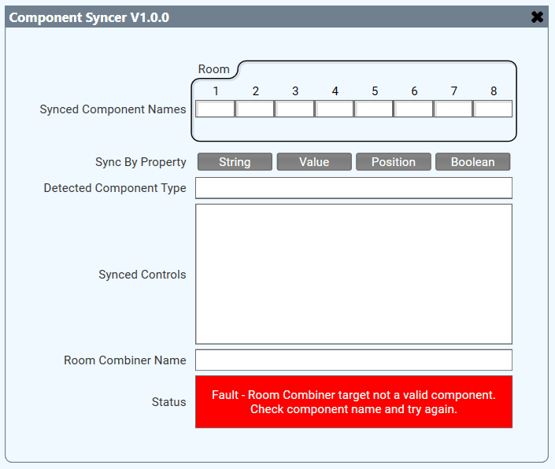
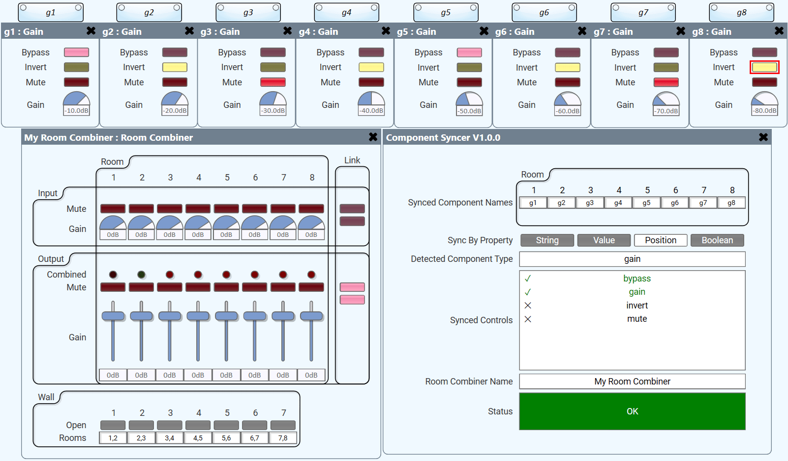

# Component Syncer for Room Combiner

Synchronises groups of like components based on a Room Combiner's state.

A Q-SYS plugin by [White Label AV](https://whitelabelav.co.nz).

## Install

Download [`roomcombine-components-syncer.qplug`](./roomcombine-components-syncer.qplug)
and drop it into your Q-SYS Designer plugins folder:

```
%USERPROFILE%\Documents\QSC\Q-Sys Designer\Plugins
```

Restart Designer, then find **Component Syncer** under *Room Combiner Add-ons* in the
Schematic Elements pane. The `.qplug` is self-contained — no other files are needed to
use it.

Full reference documentation, including the properties and controls tables, is in
[`docs/pluginhelp.htm`](./docs/pluginhelp.htm). Pressing <kbd>F1</kbd> on the plugin in
Designer opens it.

## Setup



### Synced Component Names

You need to specify at least two component names, but you do not need to specify a component for every room in your room combiner. You may have a design that does not need a synced component in every room. Non-valid component names will turn the textbox red.

The name boxes wrap into a new row every four rooms, so a high room count grows the panel downwards rather than off to the right.

### Sync By Property

These buttons specify which property from the changed control that will be pushed to other controls. They are a **radio group** — exactly one property is active at a time, and it defaults to **String**. Pressing the active button does not switch it off.

### Detected Component Type

This will show which component type is currently being detected for syncing. This is taken from the first room that has a valid component specified.

### Synced Controls

When a component type is detected, Synced Controls will show all the controls that exist within this component type. You can choose which controls that you would like to sync within a component. Indicator controls, such as LEDs, Meters, should be avoided

### Room Combiner Name

Select which Room Combiner component you want to use for your component syncronisation groups.

## Usage

Just use your Room Combiner component as usual to group rooms together. When room groups change, all synced components/controls will update to the current state of the lowest number room (with valid component) within the group. Any control within a group can be changed, and all others will syncronise with it.

### Example with Gain Components



## Caveats

### Syncing Components with different controls

There are likely some weird edge cases around syncing components that regardless of being the same type, contain different controls within them.  EG. Custom Controls, Matrices or Crossovers with different properties.  Proceed with caution if attempting this and please report any bugs.

## Building from source

The plugin source is split across `src/`, compiled into the single
`roomcombine-components-syncer.qplug` by the `qsys-dev` plugin compiler:

```bash
python build.py src/plugin.lua --bump none --deploy
```

`src/plugin.lua` is the entry point; it `#include`s `info`, `properties`, `controls`,
`layout` and `runtime` in that order, along with the shared brand header.

> **Note on the brand submodule.** The control panel header comes from
> `vendor/wlav-brand`, a **private** White Label AV repository. If you clone this repo
> without access to it, `git submodule update --init` and any build from `src/` will
> fail with `#include "../vendor/wlav-brand/brand.lua" not found` — the compiler has no
> fallback for a missing include.
>
> This only affects rebuilding. The committed `.qplug` is a fully self-contained build
> artifact with the brand tokens, header and logo already inlined, so **using** the
> plugin needs nothing extra. Issues and pull requests against `src/` are welcome; we
> will produce the branded build.

## Not implemented ideas

- **Sets of Rooms** Instead using multiple instances of the plugin to syncronise multiple sets of components, the plugin could implement sets of components. Not sure how to do Synced Control selection for each set - possible in a combo box instead of a list box beside each set.
- **Restricted Values** Consider this example: 2 combinable rooms with video switchers. There are local inputs in Room A and in Room B, and also a set of Global inputs. When uncombined both rooms should only be able to access it's own local inputs, both can access global inputs at anytime. When combined, both rooms should be able to access the other rooms local inputs also. When rooms move from combined to un-combined they must not remain on a local input that belongs to the other room. Still considering how to implement for any component/control type. See [Room Combine Switcher](https://github.com/White-Label-AV/Switcher-Room-Combiner) for an example of this feature.

## Support

- Website — [whitelabelav.co.nz](https://whitelabelav.co.nz)
- Email — [support@whitelabelav.co.nz](mailto:support@whitelabelav.co.nz)
